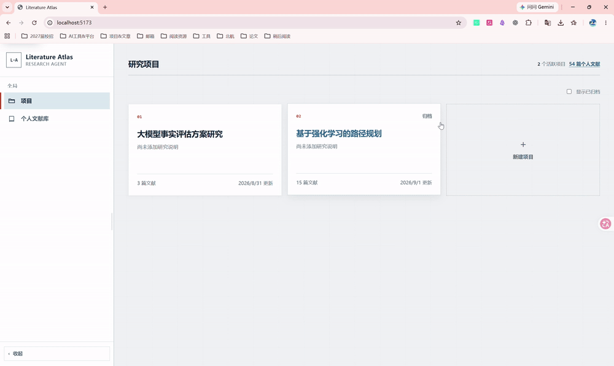
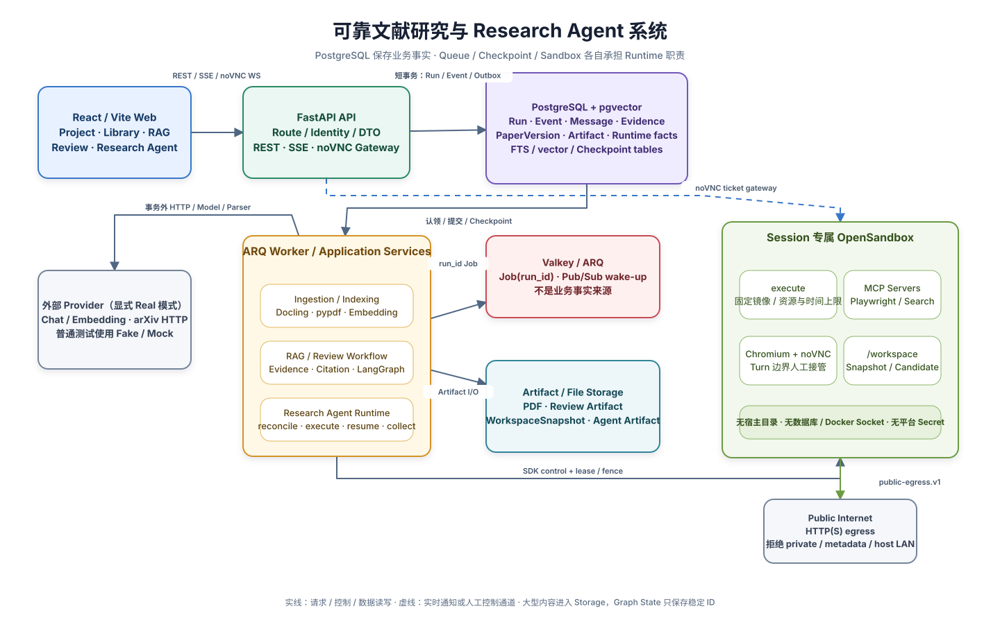

# 可靠文献研究与 Research Agent 系统

面向学术调研的全栈研究系统：将 PDF 文献管理、带页码引用的 Hybrid RAG、可暂停恢复的综述 Workflow，
以及具备受控 Browser、MCP、代码执行和 Artifact 交付能力的 Research Agent，统一放在可追溯、可取消、
可恢复的后台执行体系中。

> 当前定位是本地单人、可复现的 Demo-ready 系统，不代表公网多租户、生产级安全或 SLA 已完成。


**技术栈：** Python 3.13 · FastAPI · SQLAlchemy Async · PostgreSQL/pgvector · ARQ/Valkey ·
LangGraph/Deep Agents · OpenSandbox · React/TypeScript

## 项目解决什么问题

普通 RAG 或 Agent Demo 往往只证明“模型能生成内容”，但难以回答：

- 这个结论来自哪篇论文、哪个版本和哪一页？
- Queue 重复投递、Worker 崩溃或用户取消后，业务状态如何收敛？
- Workflow 等待人工输入时，如何释放 Worker 并在新进程中恢复？
- Agent 获得 MCP、Browser 和 `execute` 后，权限、预算与文件出口如何受控？

本项目围绕两条主线展开：

1. **Evidence-first**：生成内容先绑定稳定 Evidence，再由确定性 Validator 校验引用结构与范围；
2. **Reliable execution**：PostgreSQL 保存业务事实，Queue、Checkpoint 和 Sandbox 只承担各自的 Runtime 职责。

## 核心能力

| 能力 | 实现摘要 |
|---|---|
| 文献导入与索引 | PDF 上传或 arXiv 引入；Docling 主解析、pypdf 降级；PaperVersion、ParseRevision 与 ChunkSet 独立版本化 |
| 带引用 RAG | PostgreSQL FTS + pgvector 精确检索，经 RRF 融合；Claim 绑定 PaperVersion、页码和 Run-scoped Evidence |
| Review Workflow | 来源筛选、大纲确认两阶段 HITL；Evidence Matrix、分章节生成、引用校验和六类 Artifact 导出 |
| Research Agent | AgentSession 持续多轮上下文；逐 Turn Run、Context/Policy Snapshot、MCP/Skill/预算与跨进程恢复 |
| 受控执行环境 | Session 专属 OpenSandbox；固定 `execute`、Playwright/Search MCP、Chromium/noVNC 与 WorkspaceSnapshot |
| 可靠后台任务 | Run/Attempt/Event、Transactional Outbox、至少一次投递、协作式取消、lease/reconcile 与 SSE 断线重放 |

## 系统架构



可编辑图源位于
[`system-architecture.drawio`](docs/assets/architecture/system-architecture.drawio)，SVG 由
[`render-architecture.mjs`](scripts/render-architecture.mjs) 确定性生成。

架构中的事实边界：

- **PostgreSQL**：Run、Event、文献版本、Evidence、Message、Artifact 和 Runtime 控制的业务事实来源；
- **Valkey/ARQ**：至少一次 Job 投递与实时通知，不保存业务终态；
- **LangGraph/Deep Agents Checkpoint**：图位置与模型工作上下文，不替代权限、Event 或 Artifact；
- **Storage**：PDF、Review Artifact、WorkspaceSnapshot 与 Agent Artifact 字节；
- **OpenSandbox**：Session 专属执行环境，不挂载宿主源码、数据库、Docker Socket 或平台 Secret。

## 四条核心链路

### 1. 文献导入与索引

```text
PDF / arXiv
  → owner 范围 Paper + 不可变 PaperVersion
  → Docling / pypdf
  → ParseRevision + DocumentElement + 页码定位
  → 版本化 ChunkSet
  → PostgreSQL FTS + pgvector
```

### 2. 带引用 RAG

```text
问题 + Project 版本快照
  → FTS / vector 两路 SQL 强过滤
  → RRF + 每篇上限 + Token Budget
  → 固化 Run-scoped Evidence
  → 模型输出 Claim + Evidence ID
  → Citation Validator
  → Message / Claim / Citation / Run 原子提交
```

### 3. 可恢复 Review Workflow

```text
来源策略与候选搜索
  → 来源筛选 HITL（图外业务等待）
  → 导入、解析与索引依赖
  → Evidence Matrix
  → 大纲 HITL（LangGraph interrupt/resume）
  → 分章节生成与引用校验
  → 一致性报告与 Artifact
```

### 4. Research Agent Turn

```text
User Message
  → AgentTurnRun + ContextSnapshot + PolicySnapshot + Outbox
  → Worker reconcile-first
  → 同一 SDK Thread 追加本轮消息
  → Project Tool / MCP / Browser / OpenSandbox execute
  → Runtime result + Evidence / Artifact 校验
  → Assistant Message + Event + Run 业务终态
```

## 可靠性设计

项目按 Queue **至少一次投递**设计，不宣称分布式 Exactly Once：

- 创建 Run 时同事务写入首个 Event 与 QueueOutbox；
- ARQ Job 只携带稳定 `run_id`，Worker 重新读取 PostgreSQL 并条件认领；
- 唯一约束、状态条件更新、幂等键与内容哈希收敛重复结果；
- Attempt heartbeat/lease 与 Reconciler 处理 Worker 崩溃；
- Agent Runtime 和 Sandbox 使用独立 lease/generation/fencing，拒绝旧 owner 的迟到写入；
- SSE 以 PostgreSQL Event sequence 和 `Last-Event-ID` 重放，Valkey 通知丢失时轮询收敛；
- 外部 HTTP、模型、Parser、Storage 和 Sandbox I/O 不发生在业务数据库事务中。

仍然存在无法消除的外部窗口：Provider 或第三方 Tool 已收到请求，但本地调用账本/Checkpoint 尚未确认时，
恢复可能再次发起调用。因此准确承诺是数据库业务效果的 **Effectively Once**。

## 引用可信边界

Citation Validator 能确定性拒绝：

- 不存在的 Evidence ID；
- 跨 Run、跨 Project 或错误 PaperVersion 的引用；
- `answered` 状态下的无引用 Claim；
- 同一 Claim 的重复 Evidence；
- `insufficient_evidence` 与正常 Claim 同时出现。

它保证引用结构和范围闭包，不证明 Evidence 在语义上充分支持 Claim，也不证明论文自身正确。

## 快速开始

核心 Fake Demo 完全离线，不读取真实 Provider Key、不访问公网，也不产生模型费用。

### 环境要求

- Python 3.13 与 [uv](https://docs.astral.sh/uv/)
- Node.js 与 npm
- Docker Compose

### 安装依赖

```bash
cd backend
uv sync

cd ../web
npm install
```

### 启动 Fake Demo

```bash
./scripts/dev.sh --fake
```

访问：

- Web：<http://localhost:5173>
- API：<http://127.0.0.1:8000>
- API 文档：<http://127.0.0.1:8000/docs>
- 健康检查：<http://127.0.0.1:8000/health/ready>

Fake 模式包含版本化 Parser、Embedding、Chat、arXiv 和 Research Agent Fixture，可以完成文献导入、
RAG、两阶段 HITL Review 与 Agent UI 演示。

真实 Provider 与 OpenSandbox 是显式 opt-in，配置方式见
[`configuration-reference.md`](docs/configuration-reference.md) 和
[`local-opensandbox-server.md`](docs/runbooks/local-opensandbox-server.md)。

## 测试与评测

测试分为 Domain、Application、PostgreSQL/Valkey Integration、LangGraph/Runtime、API Contract、Web、
Playwright E2E 和显式真实基础设施 Smoke。默认自动测试不调用真实付费模型或实时学术 API。

当前公开副本整理完成时的实际回归结果：

- 后端完整套件：1424 passed、10 skipped；
- Web：204 passed，production build 通过；
- `npm ci` 依赖审计：0 vulnerabilities。

Phase 6 完成报告还记录了以下专项里程碑证据：

- Phase 6 固定安全回归：283 passed、1 skipped；
- Deep Agents 升级门禁：130 passed；
- Agent 固定评测：7/7；
- noVNC 同 Sandbox 与 public-egress/private-network 拒绝 Smoke 通过。

这些数字是阶段完成时的实际记录，不冒充当前每次提交后的实时 CI 结果。完整报告见
[`phase-06-research-agent-extension-completion.md`](docs/learning-journal/reports/phase-06-research-agent-extension-completion.md)。

固定 RAG 评测使用完全合成语料，证明检索、范围和引用管线，不代表真实模型 Groundedness。详见
[`rag-evaluation.md`](docs/learning-journal/modules/rag-evaluation.md)。

## 精选设计文档

| 主题 | 文档 |
|---|---|
| 总体架构与阶段边界 | [总体实施指南](docs/spec/literature-review-agent-system-implementation-guide.md) |
| Run、Event 与状态机 | [run-event.md](docs/learning-journal/modules/run-event.md) |
| Outbox、ARQ 与 Attempt | [queue-outbox.md](docs/learning-journal/modules/queue-outbox.md) |
| Hybrid Retrieval | [hybrid-retrieval-and-pgvector.md](docs/learning-journal/modules/hybrid-retrieval-and-pgvector.md) |
| Evidence 与 Citation | [evidence-and-citation-integrity.md](docs/learning-journal/modules/evidence-and-citation-integrity.md) |
| LangGraph 恢复 | [langgraph-checkpoint-and-crash-recovery.md](docs/learning-journal/modules/langgraph-checkpoint-and-crash-recovery.md) |
| Agent Session/Turn | [agent-session-turn-lifecycle.md](docs/learning-journal/modules/agent-session-turn-lifecycle.md) |
| Runtime 跨进程恢复 | [agent-runtime-execution-recovery.md](docs/learning-journal/modules/agent-runtime-execution-recovery.md) |
| Tool 与预算 | [agent-tool-policy.md](docs/learning-journal/modules/agent-tool-policy.md) |
| Sandbox Workspace | [agent-sandbox-workspace.md](docs/learning-journal/modules/agent-sandbox-workspace.md) |
| Browser 人工控制 | [agent-browser-control.md](docs/learning-journal/modules/agent-browser-control.md) |
| Agent Artifact | [agent-artifact-delivery.md](docs/learning-journal/modules/agent-artifact-delivery.md) |

## 仓库结构

```text
literature-research-agent/
├─ backend/   # FastAPI、Domain/Application/Adapter、Worker、迁移与测试
├─ web/       # React/Vite/TypeScript 前端
├─ docs/      # Spec、ADR、模块说明、报告与架构图
├─ sandbox/   # 固定 Research Agent 镜像和 MCP/Browser 运行环境
├─ config/    # OpenSandbox Server 固定配置
├─ deploy/    # PostgreSQL/Valkey Docker Compose
└─ scripts/   # 开发、验证与架构图渲染脚本
```

## 当前边界

- 本地 `dev_actor_id`，没有公网认证、组织 RBAC 或多租户安全证明；
- OpenSandbox 当前是 trusted-local 演示边界，未配置生产 secure runtime；
- public egress 阻止 private/metadata/宿主目标，但不解析 HTTP method 或 Browser 业务语义；
- 没有完整备份恢复、永久删除、Storage/Checkpoint GC、集中日志、OpenTelemetry 或 SLA；
- 固定评测主要验证工程契约，不评价真实模型的研究深度与写作质量；
- 不支持多 Agent、跨 Session 长期 Memory、任意 MCP、动态依赖或宿主代码执行。

项目对这些限制显式建模和记录，不把本地 Demo-ready 结论扩张成公网生产声明。
